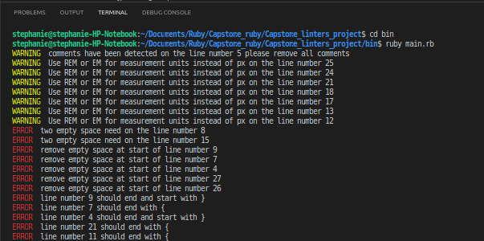

# Project 3 - CSS linter Project
This is a basic CSS linter project. It checks basic syntax in the provided CSS file and returns error messages.




## Built With
- Ruby

### Prerequisites
- Text editor
- GitHub
- Git
- Ruby
- Ruby installed.
- colorize gem


## Getting Started
To get a local copy, up and running follow these simple steps.
Clone repository from github to your local drive by following these steps:
- Open Terminal
- Change the directory to the location you want the cloned directory
- You can clone the repository by writing in the terminal:
  - `git clone  https://github.com/Stephanie041996/Capstone_linters_project.
  - Press Enter to create your local clone
- Run `cd Capstone_linters_project `** in the terminal
- Make sure you have ruby installed locally, run `ruby -v`**
- If the output does not show a ruby version, install ruby by running `sudo apt install ruby`**
- Lastly install colorize gem by running `gem install colorize`**


## To Run linter on your CSS
 Please save the style sheet file in the assets folder,then follow these steps. 
 A file is already saved for testing
- Go to bin the folder by running `cd bin`** in the terminal 
- To start the linter by typing ```ruby main.rb``` in the terminal**
- Enter the file path '../assets/style.css'
- A corrected stylesheet with no errors has been saved at '../assets/style2.css'


## Implemented Checks
  - Checks that there is no space at the end of line.
  - Checks for two space inditation on inline code.
  - Checks opening { are at the end of the line.
  - Checks closing } are on seperate line.
  - Checks for use of rem and em instead of px.
  - Checks for comments in code.

 ### Example Checks
### ***Comment check***
*- There should be no comments in the file.*

> **Bad code:**
```
/*Top nav starts here*/
.top-nav {
  padding: 2rem;
}
```

> **Good code:**

```
.top-nav {
  padding: 2rem;
}
```

### ***Space check***
*- There should be two spaces on inline code .*

> **Bad code:**
```
.nav {
margin: 1rem;
}
```

> **Good code:**

```
.nav {
  margin: 1rem;
}
```

### ***PX check***
*- There should be no use of px as the unit of measurement, use REM or EM instead*

> **Bad code:**
```
.image-heading {
  font-size: 15px;
  border-bottom-width: 10px;
  border-bottom-style: solid;
  border-color: gray;
  text-align: left;
  padding-left: 15px;
  padding-right: 150px;
}

```

> **Good code:**

```

.image-heading {
  font-size: 0.9375rem;
  border-bottom-width: 0.625rem;
  border-bottom-style: solid;
  border-color: gray;
  text-align: left;
  padding-left: 0.9375em;
  padding-right: 9rem;
}
```

### ***Start space check***
*- Space at the start of a class declaration or ending bracket '}' should be removed .*

> **Bad code:**
```
  .footer {
  padding: 1rem;
  }
```

> **Good code:**

```
.footer {
  padding: 1rem;
}
```

### ***Colon space check***
*- There should be a space after a colon.*

> **Bad code:**
```
.section{
  font:1rem;
}

```

> **Good code:**

```
.section {
  font: 1rem;
}

```

### ***Bracket check***
*- Opening bracket '{' should be on seperate line from closing bracket and code*

> **Bad code:**
```
.section {font-size: 2rem;}


```

> **Good code:**

```
.section {
font-size: 2rem;
}

```

### ***Bracket check end***
*- The closing bracket is always on a seperate line on its own*

> **Bad code:**
```
.top -footer {
  font: pink;
}.bottom-footer
```

> **Good code:**

```
.top-footer {
  font: pink;
}

.bottom-footer
```

### ***Empty space check***
*- There should be no trailing spaces at the end of lines*

> **Bad code:**
```
.social-icons a { 
  padding: 8rem;
  color: black;
  background-color: #11111115;
  border: 1rem solid #fff;
  border-radius: 50em;
}
```

> **Good code:**

```
.social-icons a {
  padding: 8rem;
  color: black;
  background-color: #11111115;
  border: 1rem solid #fff;
  border-radius: 50em;
}
```

### ***Ending check check ***
*- The end of a line with a colon should have a semi-colon ';'*

> **Bad code:**
```
p {
  font: pink
  }
```

> **Good code:**

```
p {
  font: pink;
}
```

## Testing
To test the code run the following commands on your terminal from the root directory:
  - gem install rspec
  - rspec


## Authors

👤 **Stephanie**


- GitHub: [@githubhandle](https://github.com/Stephanie041996)
- LinkedIn: [LinkedIn](https://www.linkedin.com/in/stephanie-sakuhuni-a81029140/)

## 📝 License

This project is [MIT](LICENSE) licensed.
